CANDIDATE_VERSION = 2.0.0-rc.18
CANDIDATE_COMMIT = final local commit SHA reported in result.md and final response
PRODUCER_SELF_VISUAL_QA = PASS
FRONTEND_DESIGN_VERSION = web-development 0.4 / frontend-visual-systems coordinator-first, applying the published web-development 0.3+ visual-system authority

# Asteria RC18 Visual Review Pack

This pack records Codex producer self-QA after two visual repair rounds. Round 1 found the prior Full model still too compressed for old gap gates and legacy tests still expecting Lineage chips / Fit language. Round 2 regenerated the screenshots below after the Quiet Connector and Full-model readable-reset repairs.

## Gate Summary

- Architecture trace OFF ordinary arrowheads: 0.
- Architecture trace OFF inline edge labels: 0.
- Architecture trace OFF selection visible node counts: stable sequence `[16, 16, 16, 16, 16]`.
- Architecture trace OFF shared node max delta: `0` CSS px.
- Architecture trace ON context arrowheads: 0.
- Architecture trace ON active direction terminals: 3.
- Lineage default arrowheads: 0.
- Lineage floating edge labels/chips: 0.
- Evidence default ordinary arrowheads: 0.
- Evidence floating edge labels: 0.
- Full model primary text min size: 10 CSS px.
- Full model overlap count: 0.
- Full model primary text clipped count: 0.

## Screenshots

### Architecture 1536 Dark Trace Off

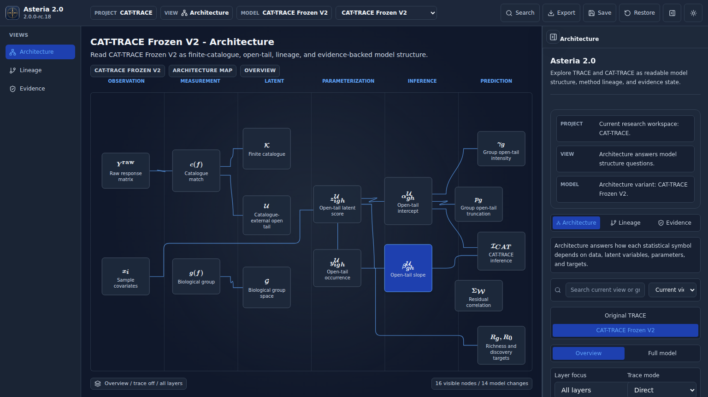

Observation: CAT-TRACE Overview is readable in dark mode; trace is off, ordinary connectors have no arrowhead sea or inline relation text, and the selected card/Inspector carry focus without changing the visible graph.

### Architecture 1366 Light Trace Off

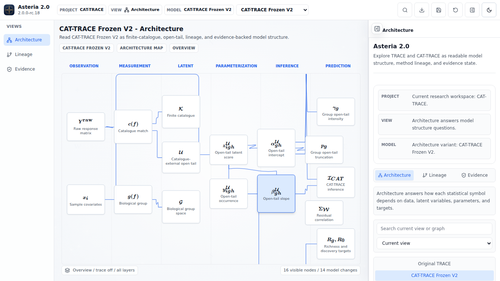

Observation: The 1366 light layout keeps all 16 overview nodes readable, with stable lane structure and no floating edge prose or default arrowheads.

### Selection-Only Sequence

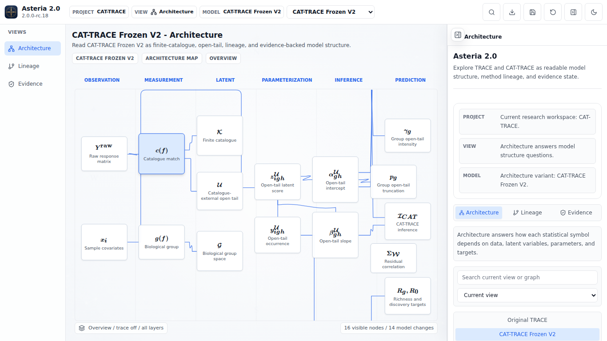

Observation: After selecting `y^U_igh`, `gamma_g`, `beta^U_gh`, and `c(f)` with trace off, the final canvas keeps the same visible node set and shared geometry; only the selected card and Inspector state change.

### Architecture Trace On

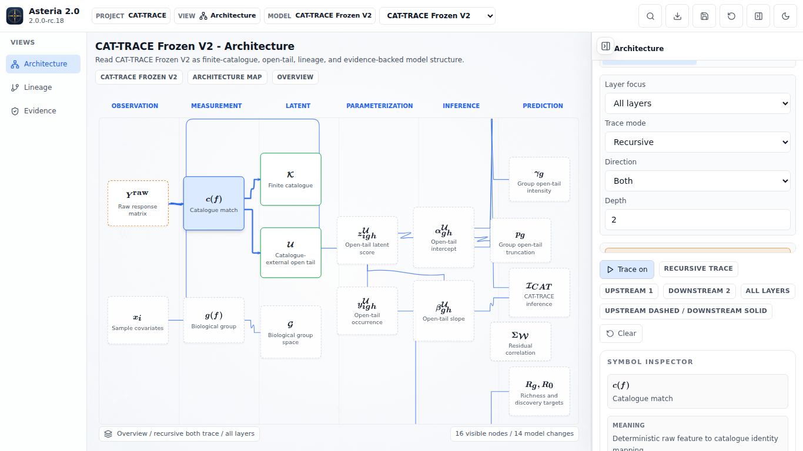

Observation: Explicit trace mode emphasizes the active path with restrained terminals while context connectors remain quiet; upstream/downstream meaning is carried by stroke grammar and Inspector, not line-attached prose.

### Full Model 1536 Dark

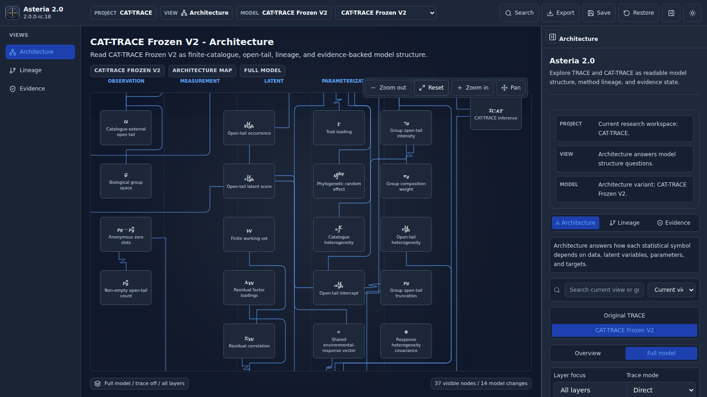

Observation: Full model is a readable exploration canvas rather than a miniature fit-all view; nodes are separated, primary symbols remain legible, and Reset plus pan/zoom provide the reading contract.

### Full Model 1366 Light

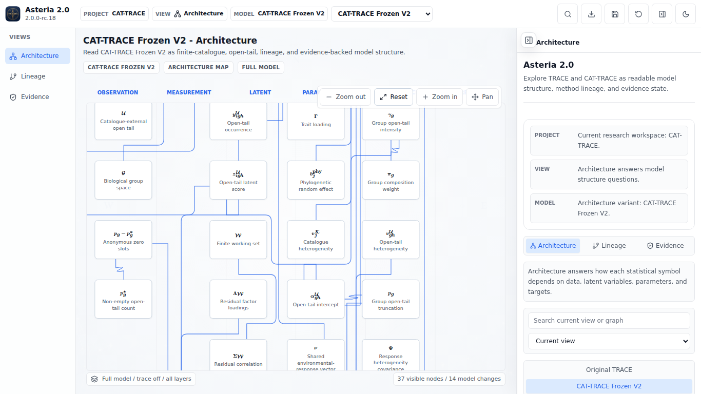

Observation: The 1366 light Full model remains readable with stable spacing; viewport clipping reflects pan/zoom exploration, not node overlap or an unreadable global shrink.

### Original TRACE

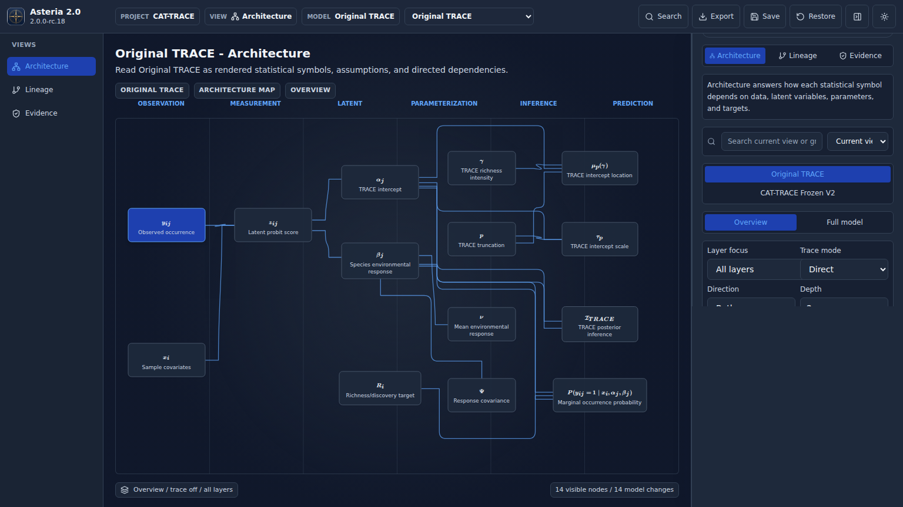

Observation: Original TRACE preserves its restrained architecture map, with readable canonical cards and no new ordinary arrow/label clutter.

### Lineage 1536 Dark

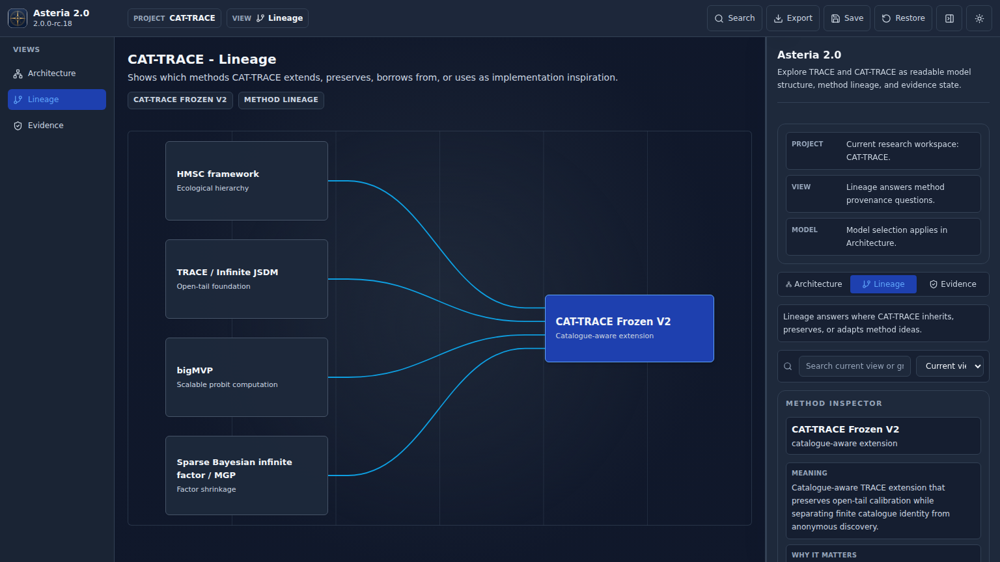

Observation: Lineage reads as a curated method-provenance diagram; source cards carry concise summaries, connectors are quiet, and there are no floating relation chips or default arrowheads.

### Lineage 1366 Light

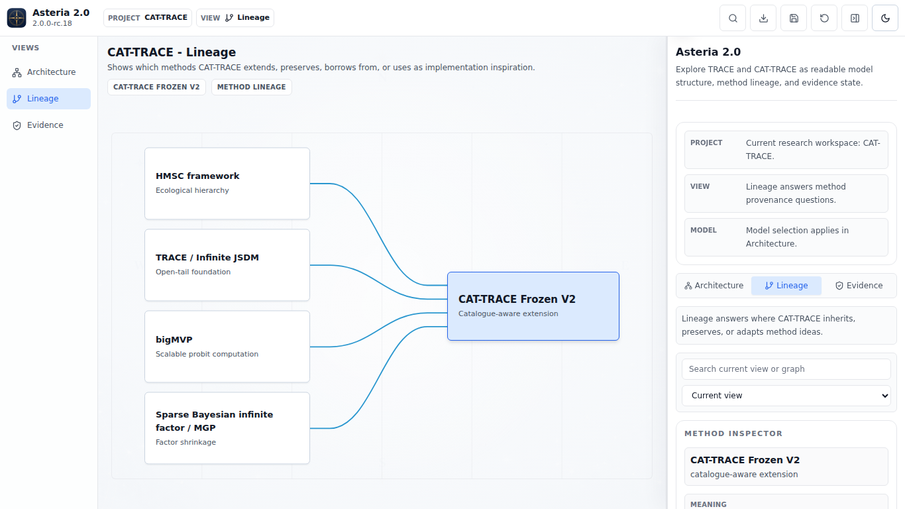

Observation: The 1366 light Lineage view preserves the same quiet grammar and safe card spacing, with typed relation metadata kept off-canvas for the Inspector.

### Evidence Default

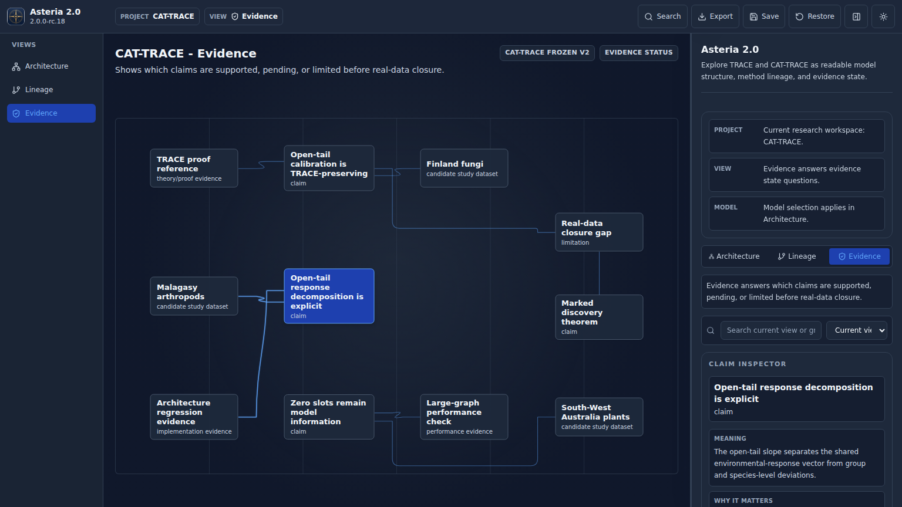

Observation: Evidence uses card kind/status and restrained connector strokes; ordinary relations have no default arrowheads or inline relation text.

### Evidence Selected Claim

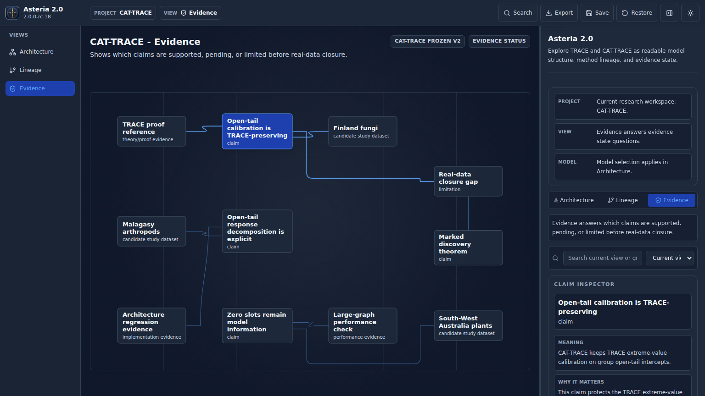

Observation: Claim selection highlights the claim card and incident relation subtly while keeping the evidence graph quiet and readable.

### Evidence Selected Dataset

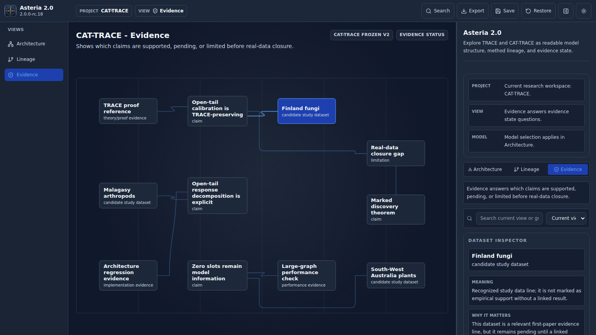

Observation: Dataset selection updates the Dataset Inspector and selected card state without changing the evidence graph into an arrow-heavy dependency diagram.

### Evidence Selected Limitation

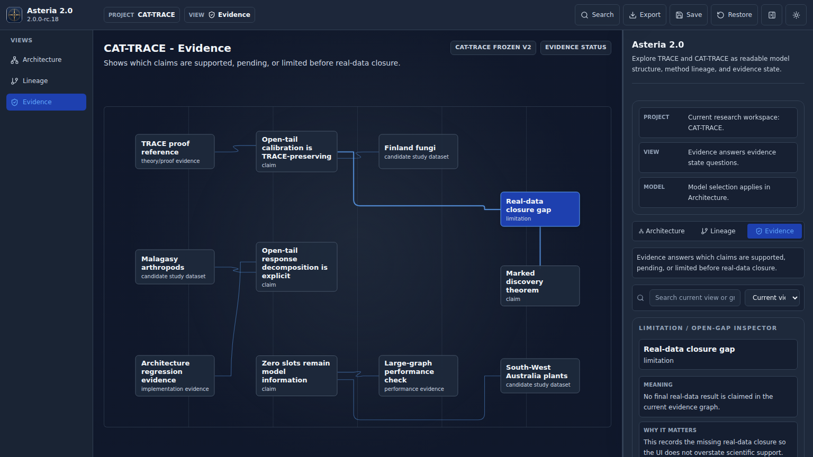

Observation: Limitation selection communicates open-gap status through the selected card and Inspector; incident connector emphasis remains restrained and no line-attached text appears.

## Producer Decision

PRODUCER_P1_COUNT = 0
PRODUCER_UNRESOLVED_MUST_FIX_P2_COUNT = 0
READY_FOR_GPT_WORK_PARENT_ACCEPTANCE = YES
