# Asteria 2.0.0-rc.19 Visual Review Pack

Candidate: `2.0.0-rc.19`
Task: `asteria--rc19-layout-first-graph-convergence`
Screenshot set: `results/asteria--rc19-layout-first-graph-convergence/screenshots/final`
Producer review: Codex self-QA, two-plus repair rounds before GPT Work

## Producer Verdict

`SELF_VISUAL_QA = PASS`

- Route gestalt: PASS. Architecture default/trace routes use layered lane flow and smooth monotone curves; no obvious half-canvas detours remain in the required states.
- Electrical-wiring smell: PASS. Ordinary maps no longer read as hard-orthogonal circuit wiring.
- Floating relation text: PASS. Lineage uses a stable relation column; Evidence and default Architecture do not place prose on curves.
- Lineage Source/Relation/Target figure: PASS. The method provenance view reads as left source cards, middle relation groups, and right CAT-TRACE target.
- Evidence claim-centeredness: PASS. Evidence screenshots keep claim/support/limitation objects grouped around the claim surface.
- Full-model readability: PASS. Full reset keeps primary symbols readable and node overlap count at zero.
- Selection-only stability: PASS. Trace-off selection sequence preserves shared geometry and visible node count.

## Screenshots

### 1. Architecture Overview, 1536 Dark, Trace Off

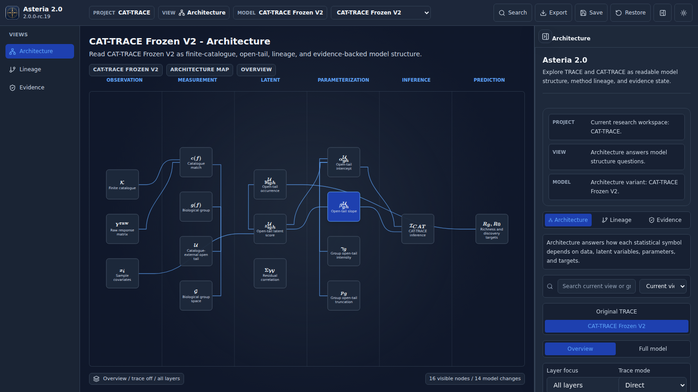

Observed: The overview keeps all 16 CAT-TRACE nodes inside the rendered stage, with smooth lane-to-lane connectors and no default arrow field or inline relation text.

### 2. Architecture Overview, 1366 Light, Trace Off

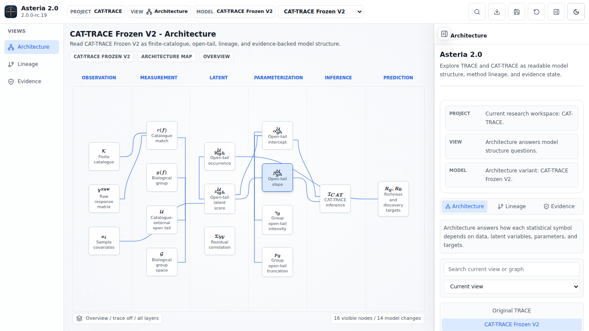

Observed: The inspector-open 1366 layout still fits the complete overview. Nodes stay readable after the compact overview density adjustment, and the map remains centered.

### 3. Selection-Only Sequence Final State, 1366 Light, Trace Off

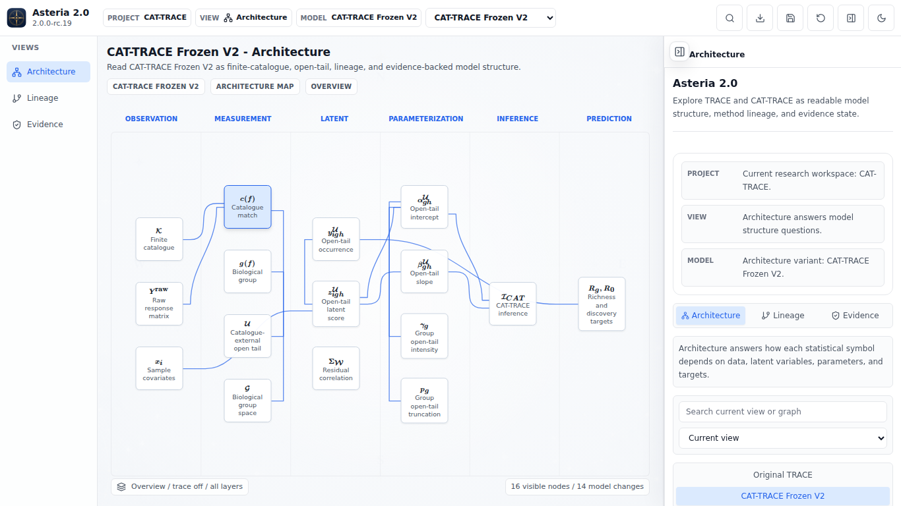

Observed: Selection updates card emphasis and inspector context without changing the visible node set or shifting the shared node layout.

### 4. Architecture Explicit Trace On, 1366 Light

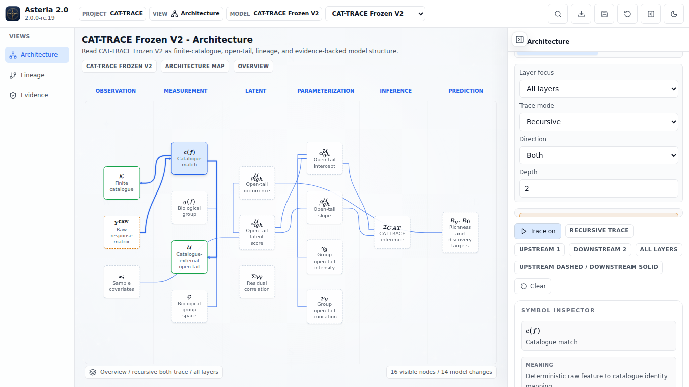

Observed: Trace-on adds only restrained active terminals/labels for the focused path. Context edges remain quiet, and the dense lane area has no card overlap or clipped primary math.

### 5. Architecture Full Model Reset, 1536 Dark

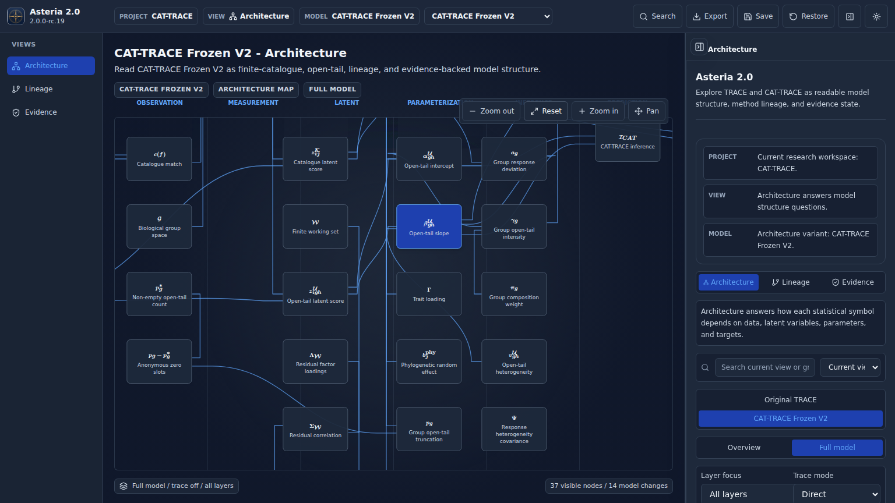

Observed: Full model is a readable exploration surface, not a fit-all miniature. Primary math remains legible and the canvas uses the available horizontal space.

### 6. Architecture Full Model Reset, 1366 Light

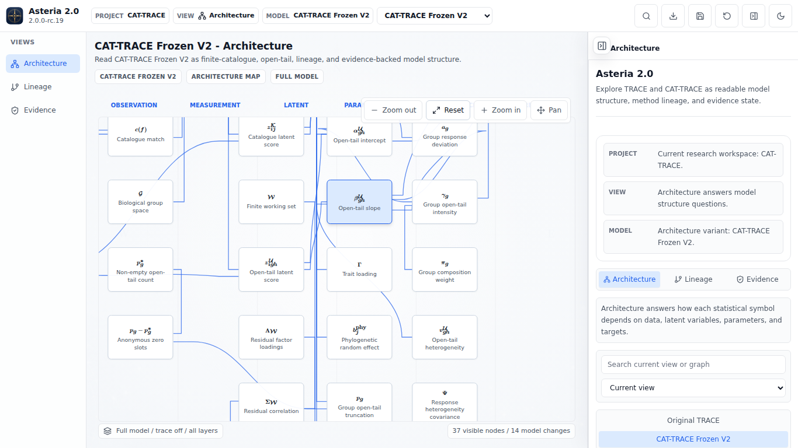

Observed: The 1366 reset keeps the selected working area readable with no node overlap; outer content is meant for pan/zoom exploration rather than a forced miniature fit.

### 7. Original TRACE Architecture, 1536 Dark

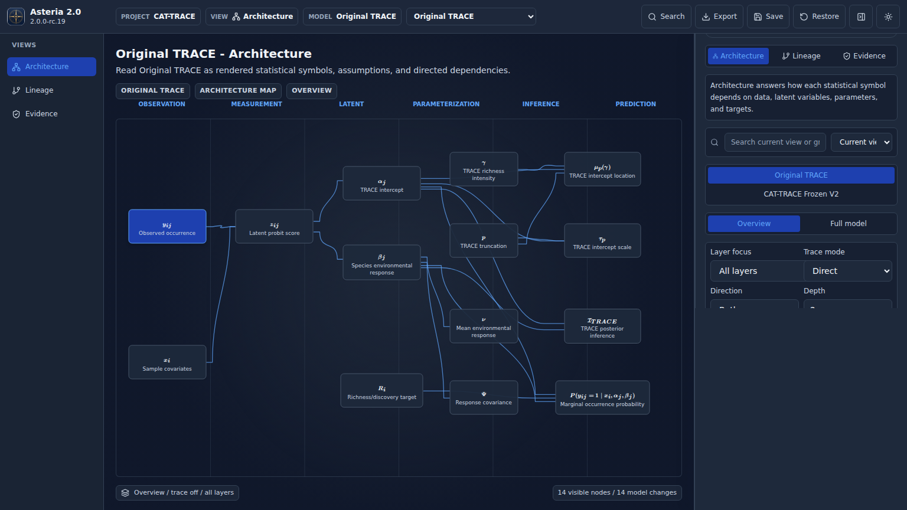

Observed: Original TRACE also uses the smooth layered route grammar; the older oversized loops are not present in the reviewed screenshot.

### 8. Lineage, 1536 Dark

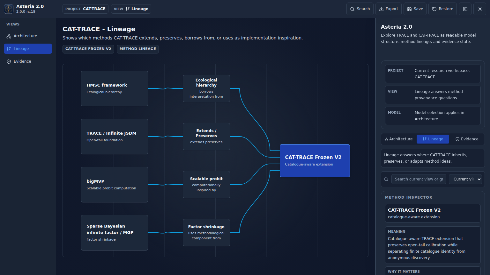

Observed: Source cards, relation column cards, and the CAT-TRACE target align as a provenance figure. Relation summaries are not floating on arbitrary path normals.

### 9. Lineage, 1366 Light

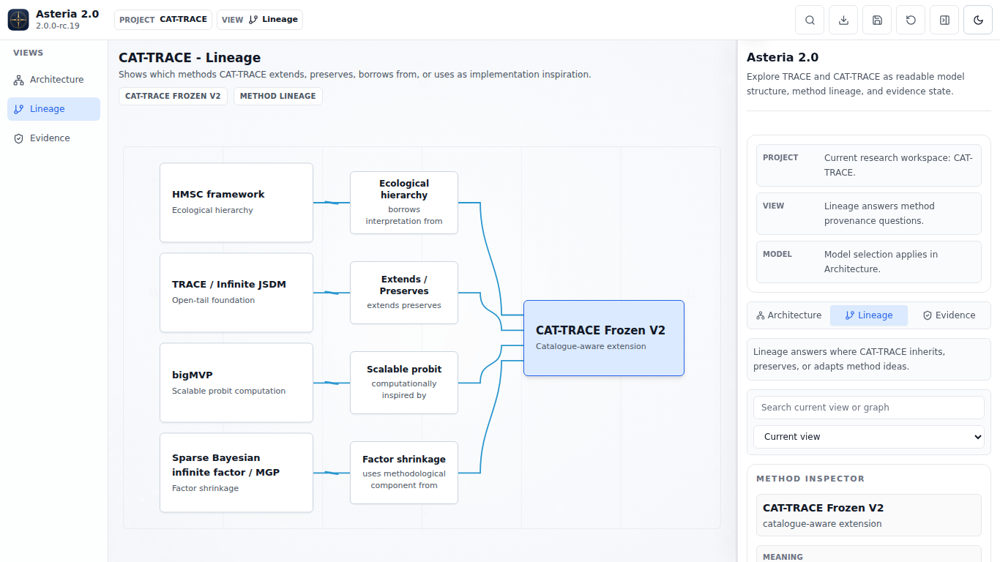

Observed: The relation-column grammar still holds in the narrower layout; source rows and relation cards remain scannable.

### 10. Evidence Default, 1536 Dark

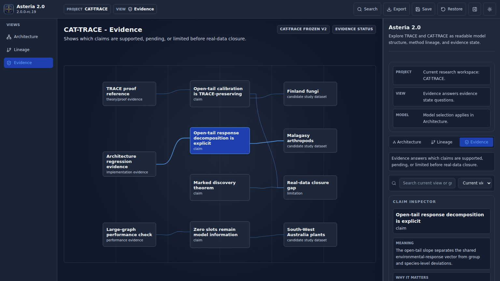

Observed: Evidence reads as claim-centered components with restrained support/pending/limitation structure, not as a generic routed line diagram.

### 11. Evidence Selected Claim, Dataset, Limitation

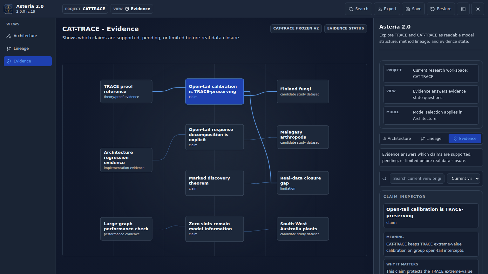

Observed: Claim selection emphasizes the relevant object and incident structure without introducing label/card collisions.

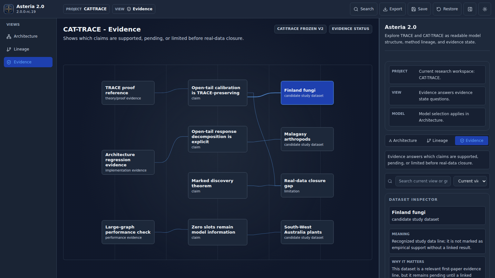

Observed: Dataset selection keeps support context local and does not send routes through the top/bottom of the full canvas.

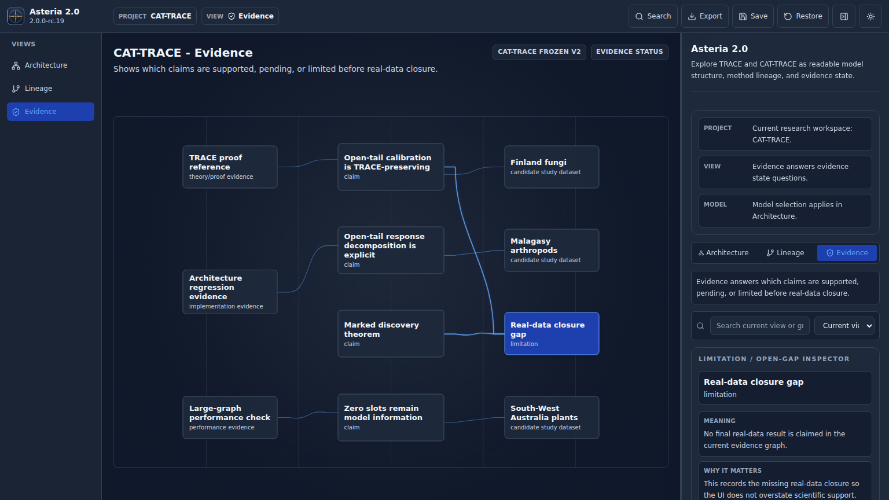

Observed: Limitation selection remains visually distinct from support claims and keeps relation semantics available through the inspector.

### 12. Synthetic Generic Layered-Graph Fixture

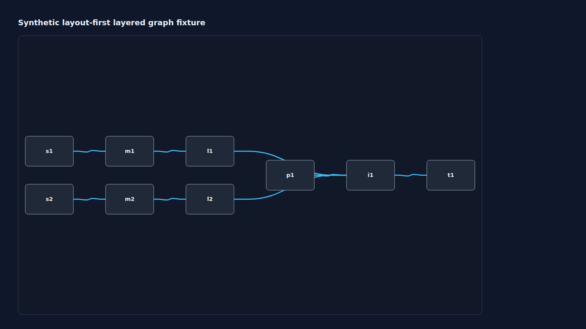

Observed: A non-CAT-TRACE lane graph uses the same generic layout-first route mechanism with smooth fan-in and no fixture-specific CAT-TRACE coordinates.

### 13. Synthetic 3/6-Source Lineage Fixtures

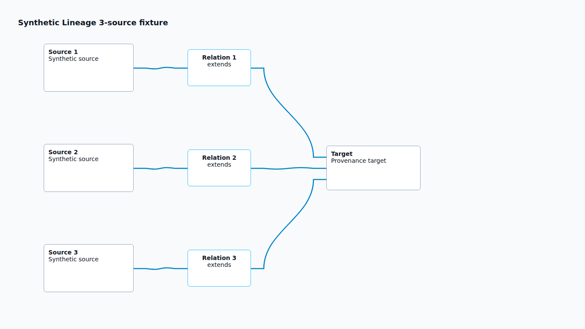

Observed: The relation-column grammar works for a three-source fixture.

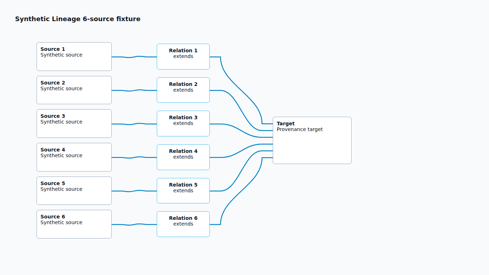

Observed: The same mechanism scales to six sources without floating relation text or arbitrary curve labels.

## Required Questions

- Are any routes obviously crooked/needlessly long? NO.
- Does any edge look like electrical wiring? NO.
- Is any relation text floating arbitrarily on a curve? NO.
- Does Lineage look like a clean Source/Relation/Target figure? YES.
- Does Evidence look claim-centered rather than auto-routed? YES.
- Does Full model remain readable? YES.
- Does selection-only preserve the map? YES.

## Self-QA Rounds

Round 1 found and repaired: 1366 overview left clipping, Original TRACE loop/detour behavior, and route-first residual geometry.

Round 2 found and repaired: trace-on overview node overlap after compact packing, plus overview primary math token overflow for `nu` and `v^U_gh`.

Final admission: full `npm run test:browser` passed 18/18 after the final screenshots above were captured.
